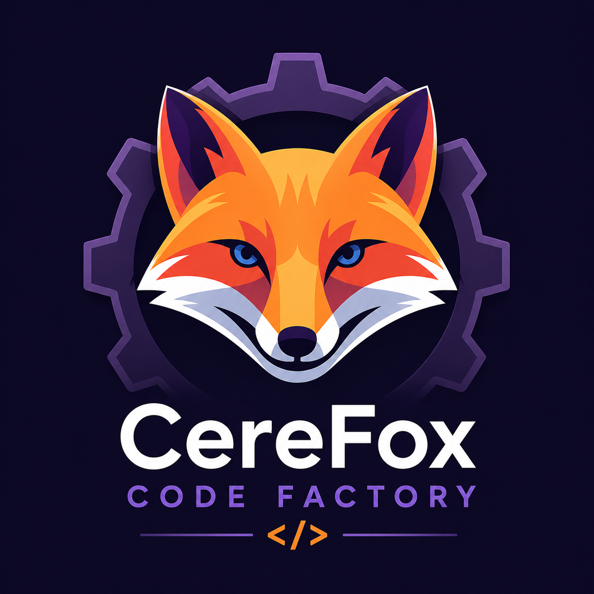

<p align="center">
  
</p>

# cfcf -- Cerefox Code Factory (cf²)

*cfcf and cf² are used interchangeably throughout this project. Both are pronounced "cf square." `cfcf` is used in code, package names, and CLI commands; cf² is used in documentation and conversation.*

A deterministic orchestration harness that runs AI coding agents in iterative loops until your problem is solved.

**cfcf is not another AI agent.** It is the orchestration layer that manages agent lifecycles, assembles context, evaluates results via a separate judge agent, and decides whether to continue, adjust, or stop. The agents do the creative coding work; cfcf does the plumbing.

> **New here?** Start with the [User Manual](docs/guides/manual.md) — 3-minute getting started + concepts + pointers to focused guides. After install, the same content is available offline via `cfcf help`.

## Status

**Early development.** First public release: `v0.16.2` on npmjs.com (May 2026). Iteration 5 largely shipped; iteration 6 in progress.

**Currently working on**: closing out iteration 5 with the npm publish pipeline + the Product Architect role; iteration 6 is the next major focus area (web UI Clio tab, multi-workspace coordination, and a few QoL items).

cfcf can be driven from the CLI or from the web GUI served by the same Hono server. For the full roadmap, decisions log, and iteration-by-iteration history, see [`docs/plan.md`](docs/plan.md) (living roadmap) + [`CHANGELOG.md`](CHANGELOG.md) (per-version changes) + [`docs/decisions-log.md`](docs/decisions-log.md) (architectural decisions + post-mortems).

## Prerequisites

### For end users (running cfcf via the installer)

- **[Git](https://git-scm.com/)** — required for iteration branch management
- **[Bun](https://bun.sh/)** v1.3+ — cfcf's runtime. The curl-bash installer below installs Bun for you if it's missing, so this is effectively automatic for first-time users.
- At least one supported AI coding agent (cfcf detects what's installed during `cfcf init`):
  - **[Claude Code](https://docs.anthropic.com/en/docs/claude-code)** (Anthropic)
  - **[Codex CLI](https://github.com/openai/codex)** (OpenAI)
  - More will be supported in the future, I just started with the dev agents I actively use

cfcf is distributed as a standard npm package (`@cerefox/codefactory`); `bun install -g` resolves the heavy native deps (transformers, ORT, sharp) the same way every JS-ecosystem CLI does. A per-platform `@cerefox/codefactory-native-<platform>` package provides the pinned libsqlite3 + sqlite-vec libs. See [`docs/guides/installing.md`](docs/guides/installing.md) for the install one-liner + local / file-URL install paths.

### For developers (building from source)

- **[Bun](https://bun.sh/)** v1.3+ — runtime and toolchain (`bun install`, `bun test`, `bun build`)
- Git + the agent CLIs above.

### Install Bun

```bash
# macOS / Linux
curl -fsSL https://bun.sh/install | bash

# Windows
powershell -c "irm bun.sh/install.ps1 | iex"
```

### Install an AI Agent

```bash
# Claude Code (requires Anthropic account)
npm install -g @anthropic-ai/claude-code

# Codex CLI (requires OpenAI account)
npm install -g @openai/codex
```

## Install (end users)

cfcf is published on npmjs.com as [`@cerefox/codefactory`](https://www.npmjs.com/package/@cerefox/codefactory). One-liner (handles the full toolchain bootstrap automatically — Bun + npm + npm-prefix-fix-if-needed, then installs cfcf, runs `cfcf doctor`, hands off to `cfcf init`):

```bash
curl -fsSL https://github.com/fstamatelopoulos/cfcf/releases/latest/download/install.sh | bash
```

No sudo, no surprises. The script bootstraps any missing toolchain bits (Bun is cfcf's runtime; npm is the install tool — chosen over `bun install` because Bun blocks postinstall scripts by default and would break cfcf's native deps without explicit trust prompts). All shell-rc edits are sentinel-marked and removable.

If you already have Bun + npm set up the way you like, you can skip the wrapper:

```bash
npm install -g @cerefox/codefactory
cfcf doctor && cfcf init
```

For offline / airgapped / pinned-mirror installs, see [`docs/guides/installing.md#tarball--offline--pinned-mirror-install`](docs/guides/installing.md#tarball--offline--pinned-mirror-install) — every release also publishes tarballs to GitHub Releases as a fallback.

Full install guide (upgrade, uninstall, platform support, troubleshooting): [`docs/guides/installing.md`](docs/guides/installing.md).

## Getting Started (developers)

```bash
# Clone the repo
git clone https://github.com/fstamatelopoulos/cfcf.git
cd cfcf

# Install dependencies
bun install

# Run first-time setup (detects agents, configures defaults)
bun run dev:cli -- init

# Start the server
bun run dev:cli -- server start

# Create a workspace linked to a git repo
bun run dev:cli -- workspace init --repo /path/to/your/project --name my-app

# Edit the problem definition
# (cfcf scaffolds problem-pack/problem.md and problem-pack/success.md for you)

# Launch the AI agent against your problem
bun run dev:cli -- run --workspace my-app

# Or run a manual command (for testing)
bun run dev:cli -- run --workspace my-app -- npm test
```

## Development

```bash
# Run all tests
bun run test

# TypeScript type checking
bun run typecheck

# Build the npm-format CLI tarball (dist/cfcf-X.Y.Z.tgz)
bun run build

# Start server in watch mode (auto-restart on changes)
bun run dev:server

# Run CLI commands during development
bun run dev:cli -- <command>
```

## Project Structure

```
cfcf/
  packages/
    core/               # Shared types, config, adapters, context assembly
    server/             # Hono HTTP server (backbone)
    cli/                # Commander.js CLI (user interface)
  problem-packs/        # Example problem definitions
    example/            # Calculator module example
  docs/
    plan.md                       # Development roadmap and decision log
    decisions-log.md              # Lessons learned
    design/                       # Specs and architecture
      cfcf-requirements-vision.md
      cfcf-stack.md
      technical-design.md
      agent-process-and-context.md
    api/                          # API reference
      server-api.md
    guides/                       # User guides
      workflow.md                 # Full user workflow (main user guide)
      cli-usage.md                # CLI command reference
    research/                     # Designs in flight or historical
      reflection-role-and-iterative-planning.md
  CLAUDE.md             # AI agent context (for Claude Code, Codex, etc.)
  CHANGELOG.md          # Release notes (follows Keep a Changelog)
```

### Five Agent Roles

cfcf uses five independently configurable agent roles -- each role can use
a different adapter and model:

| Role | Purpose |
|------|---------|
| Solution Architect | Reviews Problem Pack, produces / extends `plan.md` |
| Dev agent | Writes code, runs tests, authors per-iteration changelog |
| Judge agent | Per-iteration assessment + `reflection_needed` opt-out signal |
| Reflection agent | Cross-iteration strategic review, non-destructive plan edits |
| Documenter | Polished final docs after SUCCESS |

## Architecture at a Glance

```
User (CLI / Web GUI)
    |
    v
cfcf Server (Hono on Bun, serves API + static web GUI)
    |
    +-- Workspace Manager         (config, state)
    +-- Iteration Controller      (loop: prepare -> dev -> judge -> reflect? -> decide -> documenting)
    +-- Runners                   (architect [first-run or re-review], judge, reflection, documenter)
    +-- Process Manager           (spawn agents, capture logs)
    +-- Active Processes Registry (track + kill on shutdown)
    +-- Context Assembler         (merge sentinel block into CLAUDE.md/AGENTS.md, build cfcf-docs/)
    +-- Plan Validator            (non-destructive rewrite check for architect + reflection)
    +-- Workspace History         (persistent audit trail: review / iteration / reflection / document)
    +-- Notifications Dispatcher  (terminal bell / macOS / Linux / log)
    +-- Memory Layer              (file-based, in repo + ~/.cfcf/ for logs)
    |
    v
Agent Processes (Claude Code, Codex, etc.)
    running in user's local dev environment
```

## How It Works

1. You define your problem in Markdown files (problem.md, success.md, optional constraints / hints / context).
2. (Recommended) The **Solution Architect** reviews the Problem Pack and produces an implementation plan with **phases mapped to concrete iterations** (`## Iteration 1 -- Foundation`, etc.). On re-review (a workspace with prior iterations) the architect appends new iterations non-destructively when new requirements appear.
3. cfcf creates a feature branch and assembles context for the AI agent. The cfcf-owned block is written between sentinel markers in `CLAUDE.md` (Claude Code) or `AGENTS.md` (Codex); any user-authored content outside the markers is preserved across iterations.
4. The **dev agent** reads context and executes **one phase per iteration**: picks up the next pending chunk from `cfcf-docs/plan.md`, does just that, marks it `[x]` with a brief note, writes a per-iteration changelog under `cfcf-docs/iteration-logs/`, and exits.
5. The **judge agent** reviews the iteration and produces structured feedback (determination, quality score, tests, concerns, reflection opt-out).
6. The **reflection agent** reads the full cross-iteration history and may non-destructively rewrite pending plan items (completed work is protected; destructive rewrites are auto-reverted). Reflection runs after every iteration unless the judge explicitly opts out; even then cfcf forces reflection after `reflectSafeguardAfter` consecutive opt-outs (default 3). Reflection can set `recommend_stop` to pause the loop for the user.
7. Each iteration produces up to three separate commits (dev / judge / reflect). cfcf merges the feature branch to main (auto-merge mode) and starts the next iteration -- a brand new agent process that reads the updated plan and picks up from there.
8. Repeat until success criteria are met, reflection recommends stopping, or iteration limits are reached. On success, the **documenter** produces polished `docs/` before the loop ends.

## Configuration

cfcf stores its config in the platform-standard directory:
- **Linux:** `~/.config/cfcf/config.json`
- **macOS:** `~/Library/Application Support/cfcf/config.json`
- **Windows:** `%APPDATA%/cfcf/config.json`

Override with `CFCF_CONFIG_DIR` environment variable.

## License

Licensed under the [Apache License, Version 2.0](LICENSE) — same license used by the rest of the [Cerefox](https://github.com/fstamatelopoulos/cerefox) ecosystem. You may use, modify, and redistribute the code under the terms of that license.

---

*cfcf is part of the [Cerefox](https://github.com/fstamatelopoulos/cerefox) ecosystem.*
